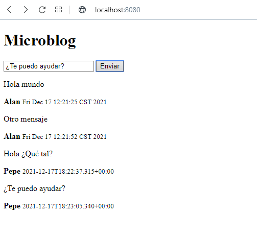

# Java Spring Boot Course

 Por [Alan Badillo Salas](https://github.com/dragonnomada)

**About Me**

I studied **Applied Mathematics** at *Universidad Autónoma Metropolitana* 
and **Master in Computer Science / Artificial Intelligence** at *Instituto Politécnico Nacional*.

I have taught courses for **Advanced Programming** in several programming languages
including C/C++, C#, Java, Python, Javascript
and platforms like Android, IOS, Xamarin, React, Vue, Angular, Node, Express.
**Data Science** on Data Mining, Data Visualization, Machine Learning, Deep Learning
and **Databases** development and administration for SQL and NoSQL like MySQL, SQL Server and Mongo.
Since *7 years* in several institutes 
including *IPN-CIC*, *KMMX*, *The Inventor's House*, *Auribox*.
For several clients including *BANXICO*, *INEGI*, *CFE*, *PGJ*, *SEMAR*, *Universities*, *Oracle* and *Intel*.

Github: [@dragonnomada](https://github.com/dragonnomada)
Twitter: [@badillosoft](https://twitter.com/badillosoft)
LinkedIn: [/in/dragonnomada](https://www.linkedin.com/in/dragonnomada/)

## Introduction

This is a master course about [Spring Boot](https://spring.io/projects/spring-boot).

## AVISOS IMPORTANTES

**17 de diciembre de 2021**

*Ejercicio de MicroServicios completado*

Hola a todos, lamento no poderles enseñar el ejercicio funcionando. 
El ejercicio quedó resulto y adjunto y pueden encontrar las capturas de pantalla
como [Microservicios1.png](./schemas/Microservicios1.png),
[Microservicios1.png](./schemas/Microservicios2.png),
[Microservicios1.png](./schemas/Microservicios3.png),
[Microservicios1.png](./schemas/Microservicios4.png),
[Microservicios1.png](./schemas/Microservicios5.png),
[Microservicios1.png](./schemas/Microservicios6.png)

El día lunes lo revisamos, pero si pueden revísenlo este fin de semana.

---

## Links

[Click here for Spring Boot Links](https://pinboard.opera.com/view/7dad86f4-2a77-4eb8-a05f-8efe6388f370)

## Content

Módulo 1: EL PROYECTO DE SPRING Y EL FRAMEWORK
Introducción a Spring Framework
Bootstrapping
El contexto de la aplicación
Herramientas Adicionales - Proyecto Lombok

Módulo 2: CONSTRUIR UNA APLICACIÓN SPRING
Inyección de dependencia en Spring
Configuración de aplicaciones Spring Boot

Módulo 3: PRUEBAS DE APLICACIONES DE SPRING
Aplicando Pruebas Unitarias
Pruebas de integración

Módulo 4: EL PATRÓN MVC
Presentando el patrón MVC
Fundamentos de Spring Web MVC
Spring Web MVC Controller

Módulo 5: VISUALIZACIÓN DE INFORMACIÓN UTILIZANDO PÁGINAS WEB
Plantillas HTML con Thymeleaf
Visualización de datos utilizando un modelo y enlace de datos

Módulo 6: PASAR DATOS ENTRE LA VISTA Y EL CONTROLADOR
Manejo de formularios
Tipos de entrada de formulario y enlace de valor

Módulo 7: RESTFUL APIS
¿Qué es una API RESTful?
Hypermedia con Spring Boot.

Módulo 8: SEGURIDAD DE APLICACIÓN WEB
Asegurar su aplicación web
Seguridad de Spring

Módulo 9: DATOS PERSISTENTES UTILIZANDO UNA BASE DE DATOS
Bases de datos relacionales y SQL
Acceso a la base de datos desde Java con JDBC y JdbcTemplate
Actualizaciones de esquemas
Soporte avanzado de base de datos

